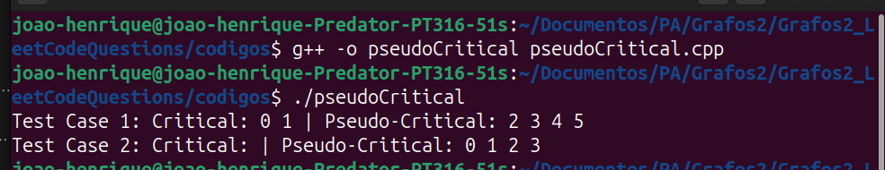

# Leet Code Questions

**Número da Lista**: 7<br>
**Conteúdo da Disciplina**: Grafos 2<br>

## Alunos
|Matrícula | Aluno |
| -- | -- |
| 19/0085819  |  Cicero Barrozo Fernandes Filho |
| 20/0067923  |  João Henrique Marques Calzavara |

## Sobre 
&emsp;&emsp;Esse projeto visa desenvolver questões sobre o conteúdo ministrado de Grafos 2, com foco nos algoritmos de Djikstra, e o algoritmo de Prim. Para isso, serão feitas questões de média ou alta dificuldade da plataforma de juíz online, ***Leet Code*** que nos fornece uma alta quantidade de questões desses temas a serem feitas. Onde o **algoritmo de Dijkstra** é usado para encontrar o caminho mais curto de um vértice de origem a todos os outros vértices de um grafo, atribuindo pesos às arestas e garantindo que os caminhos calculados sejam os de menor custo. Já o **algoritmo de Prim** é utilizado para encontrar a árvore geradora mínima de um grafo, ou seja, um subconjunto de arestas que conecta todos os vértices do grafo com o menor peso total possível, sem formar ciclos.

## Questões

|Questão | Dificuldade | Código presente em:|
| -- | -- | -- |
| [1928. Minimum-cost-to-reach-destination-in-time](https://leetcode.com/problems/minimum-cost-to-reach-destination-in-time/)  |  ***Difícil*** | [minCostDest.cpp](codigos/minCostDest.cpp) |
|  [1489. Find-critical-and-pseudo-critical-edges-in-minimum-spanning-tree](https://leetcode.com/problems/find-critical-and-pseudo-critical-edges-in-minimum-spanning-tree/description/) |  ***Difícil*** | [pseudoCritical.cpp](codigos/pseudoCritical.cpp)|
| [1568. Minimum Number of Days to Disconnect Island](https://leetcode.com/problems/minimum-number-of-days-to-disconnect-island/description/) | ***Difícil*** | [disconnectIsland.cpp](codigos/disconnectIsland.cpp)| 
| [1584. Min Cost to Connect All Points](https://leetcode.com/problems/min-cost-to-connect-all-points/description/) | ***Médio*** | [minCostConnect.cpp](codigos/minCostConnect.cpp)| 

## Screenshots
### minCostDest.cpp
- Rodando o arquivo C++ no terminal na pasta onde ele se encontra, após **descomentar** os testes no final do arquivo:
    - 
- Rodando o arquivo no ***Leet Code*** com seus testes passando:
    - 
- Submissão aceita no ***Leet code***:
    - 
<br>

### pseudoCritical.cpp
- Rodando o arquivo C++ no terminal na pasta onde ele se encontra, após **descomentar** os testes no final do arquivo:
    - 
- Rodando o arquivo no ***Leet Code*** com seus testes passando:
    - 
- Submissão aceita no ***Leet code***:
    - 
<br>

### disconnectIsland.cpp
- Rodando o arquivo C++ no terminal na pasta onde ele se encontra, após **descomentar** os testes no final do arquivo:
    - 
- Rodando o arquivo no ***Leet Code*** com seus testes passando:
    - 
- Submissão aceita no ***Leet code***:
    - 
<br>


### minCostConnectAll.cpp
- Rodando o arquivo C++ no terminal na pasta onde ele se encontra, após **descomentar** os testes no final do arquivo:
    - 
- Rodando o arquivo no ***Leet Code*** com seus testes passando:
    - 
- Submissão aceita no ***Leet code***:
    - 
<br>


## Instalação 
**Linguagem**: C++<br>

## Uso 
- Para rodar o projeto:
    - Faça o clone do repositório ou baixe o zip dele:
        - ```git clone https://github.com/projeto-de-algoritmos-2024/Grafos2_LeetCodeQuestions.git ```
    - Após ter a pasta do projeto, rode no terminal de sua máquina dentro da pasta ***Leet_Code_Questions***,  descomente a main dos testes no final dos arquivos .cpp, e execute os seguintes comandos:
        - Para compilar o executável:```g++ -o minCost minCostDest.cpp```<br>Para rodar o executável:```./minCost ```

        - Para compilar o executável:```g++ -o pseudoCritical pseudoCritical.cpp```<br>rodar o executável:```./pseudoCritical ```

        - Para compilar o executável:```g++ disconnectIsland.cpp -o disconnect```<br>rodar o executável:```./disconnect  ```

        - Para compilar o executável:```g++ minCostConnect.cpp -o minCostConnect```<br>rodar o executável:```./minCostConnect  ```

    - Para testar no ***leet code***:
        - Entre nos ***links*** presentes na tabela de questões, copie o código da questão que quer testar, escolha a linguagem C++ e clique em ***run*** ou ***submit*** para testar os códigos ***(lembre de deixar a main de teste comentados para testar no leet code)***.

## Link para o vídeo 

https://www.youtube.com/watch?v=ZnVj1SV_Em4


